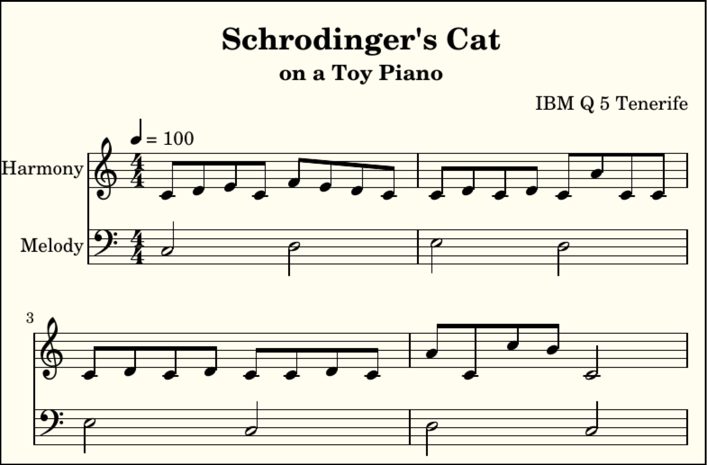
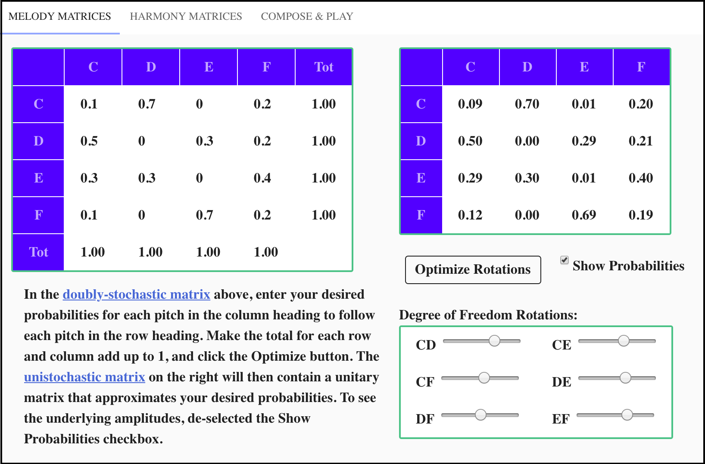

# Quantum Toy Piano

The Quantum Toy Piano application enables a user to compose music that is performed by a quantum computer. The musical composition consists of a series of quantum circuits. Each note in the *performance* of a composition is a quantum state, which when measured results in a pitch determined by quantum mechanical behavior. This normally results in unique melodies and harmonies each time a given composition is performed by the quantum computer. Fig. 1 contains the music score captured from one such performance.

FIG. 1. Music score captured from performance of a quantum musical composition

To create a quantum musical composition, the user first supplies the desired probabilities for a given pitch to follow another given pitch melodically. Take a moment to examine the music score in Fig. 1 and notice that the staff labeled **Melody** contains an eight-note melody, and realize that the staff labeled **Harmony** actually contains seven four-note melodies.  These probabilities are entered by the user into the doubly-stochastic matrix located on the left side of the **MELODY MATRICES** tab, shown in Fig 2. 

FIG. 2. User interface for composing quantum melodic progressions

Clicking the **Optimize Rotations** button creates a unitary matrix TODO: LEFT OFF HERE

Here's the Lilipond string: 

\version "2.18.2" \paper {#(set-paper-size "a5")} \header {title="Schrodinger's Cat" subtitle="on a Toy Piano" composer = "A. Quantum Computer"}  melody = \absolute { \clef "bass" \numericTimeSignature \time 4/4 \tempo 4 = 100 c2 f2 e2 c2 d2 c2 c2 c2} harmony = \absolute { \clef "treble" \numericTimeSignature \time 4/4  e'8 c''8 e'8 d'8 d'8 e'8 c'8 d'8 c'8 a'8 f'8 c'8 e'8 f'8 c'8 d'8 f'8 c'8 f'8 c'8 e'8 f'8 f'8 f'8 e'8 d'8 c'8 f'8 c'2} \score { << \new Staff \with {instrumentName = #"Harmony"}  { \harmony } \new Staff \with {instrumentName = #"Melody"}  { \melody } >> }

## Installation

To install.

