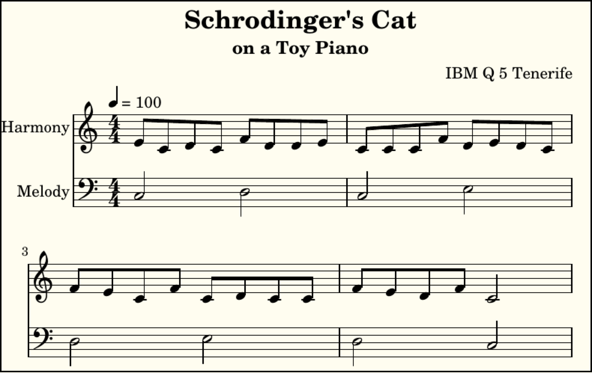
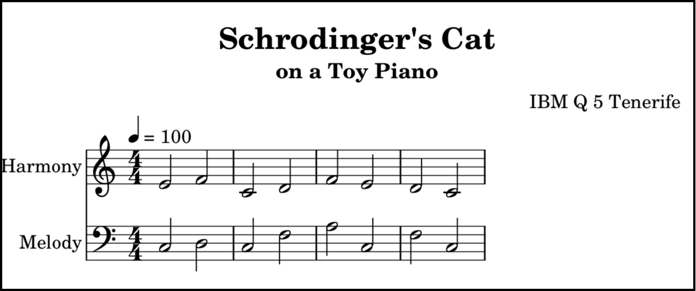
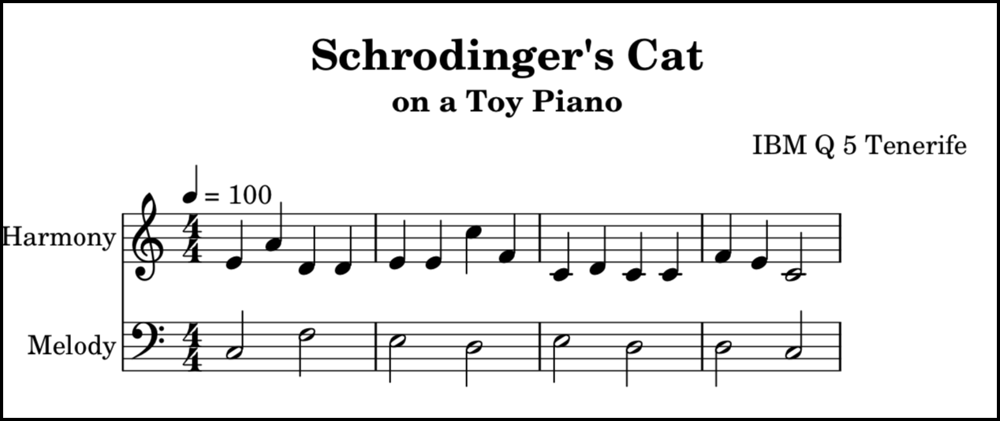
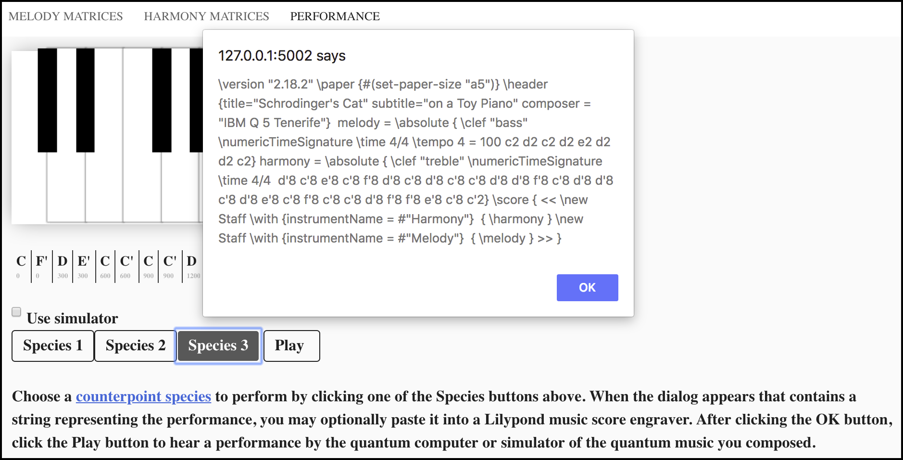

# Quantum Music Composer for IBM quantum computers

The Quantum Music Composer application enables a user to compose music that is performed by a quantum computer or quantum simulator. The musical *composition* consists of a series of quantum circuits. Each quantum musical tone [[1]](#references) in the *performance* of a composition is a quantum state, which when measured results in a pitch determined by quantum mechanical behavior. This normally results in unique melodies and harmonies each time a given composition is performed by a quantum computer or simulator. Fig. 1 contains a musical score captured from one such performance.

FIG. 1. Musical score captured from the performance of a quantum musical composition

## Creating a quantum musical composition

To create a quantum musical composition, the user first supplies the desired probabilities for a given pitch to follow another given pitch *melodically*. Take a moment to examine the music score in Fig. 1 and notice that the staff labeled **Melody** contains an eight-note melody. Please also realize that the staff labeled **Harmony** actually contains seven four-note melodies.  Users enter their desired probabilities into the [doubly-stochastic matrix](https://en.wikipedia.org/wiki/Doubly_stochastic_matrix) located on the left side of the **MELODY MATRICES** tab, shown in Fig 2. 

FIG. 2. User interface for composing quantum melodic progressions

Clicking the **Optimize Rotations** button updates the [orthogonal matrix](https://en.wikipedia.org/wiki/Orthogonal_matrix) on the right to contain values, that when squared, comprise a [unistochastic matrix](https://en.wikipedia.org/wiki/Unistochastic_matrix) that approximates the user's desired probabilities. Deselecting and selecting the **Show Probabilities** checkbox toggles between showing the orthogonal matrix and the unistochastic matrix, respectively. The application optimizes the unistochastic matrix by gradually changing the angles of the six degree-of-freedom rotations in four-dimensional vector space until the difference between the doubly-stochastic matrix and the unistochastic matrix is minimized.  You can experiment with the effects of each rotation on the matrix on the right by using the sliders in the **Degree of Freedom Rotations** region of this tab. Each slider has the range  radians.

To continue creating the quantum musical composition, the user supplies the desired probabilities for a given pitch to be played *harmonically* with another given pitch. Take another moment to examine the musical score in Fig. 1 and notice that each of the notes in the staff labeled **Melody** have a note in the staff labeled **Harmony** directly above it. Users enter their desired probabilities into the [doubly-stochastic matrix](https://en.wikipedia.org/wiki/Doubly_stochastic_matrix) located on the left side of the **HARMONY MATRICES** tab, shown in Fig 3.

FIG. 3. User interface for composing quantum harmonic intervals

The harmonic probabilities entered will apply to all of the notes played harmonically in the performance except for the final note on each staff, as those two notes will have the same [pitch class](https://en.wikipedia.org/wiki/Pitch_class) as the first note in the melody staff. These notes provide a sense of resolution and finality to the performance, and are the only two notes in the performance that aren't determined by the quantum computer.

## Performing a quantum musical composition

To finish composing and to have the quantum computer or simulator perform your quantum musical composition, navigate to the **Performance** tab shown in Fig 4.

FIG. 4. User interface for the performance of your quantum musical composition

By default the **Use simulator** checkbox is selected, but to indicate that you want to use a real quantum computer, deselect the checkbox. Also by default, the starting note of the melody in your composition will be in the C pitch class. You may choose a different starting note (either D, E or F) by selecting it from the on-screen piano keyboard. As mentioned earlier, the ending note in both the melody and harmony staves will be of the same pitch class as the starting note of the melody. Choosing a different starting note puts your your composition into a different [musical mode](https://en.wikipedia.org/w/index.php?title=Musical_mode), giving it a different quality or feeling.  

The buttons labeled **Species** refer to three of the five [species of counterpoint music](https://en.wikipedia.org/wiki/Counterpoint#Species_counterpoint). Fig. 1 is an example of third species counterpoint, insofar as it meets the requirement of having four notes in one staff against one note in another staff. Figs. 5 and 6 show example quantum computer performances of first and second species counterpoint (to the extent that they meet the note against note, and two notes against one note, requirements respectively). 

FIG. 5. Musical score captured from the performance of a first species composition

FIG. 6. Musical score captured from the performance of a second species composition

There are many more characteristics of species counterpoint, some of which you may choose to implement by defining corresponding melodic and harmonic probabilities. Of course, as a composer of quantum music, you may choose to define probabilities that cause the quantum computer to perform music that better suits your tastes.

After choosing one of the **Species** buttons shown in Fig. 4, quantum circuits that express your desired melodic probabilities, harmonic probabilities, counterpoint species, and melody starting note, will be sent to the quantum computer or simulator. When the quantum circuits are finished running, the dialog shown in Fig. 7 is displayed. This dialog contains text that may be pasted into a [LilyPond](http://lilypond.org/manuals.html) music score engraver to produce musical scores like the one shown in Fig. 1. 

FIG. 7. Dialog that contains the musical score expressed in LilyPond notation

After clicking the OK button in the dialog in Fig. 7, you can hear the quantum computer's performance of your composition by clicking the **Play** button. Please note that occasionally there is some delay at the beginning of playback after which the beginning notes play faster than they should. If that happens, click the **Stop** button and click the **Play** button again.

## Installation

To install and run Quantum Music Composer:

1. Ensure that [Python 3.5 or later](https://www.python.org/downloads/) is installed
2. Install [Flask](http://flask.pocoo.org/)
3. Install [Flask-CORS](https://flask-cors.readthedocs.io) or a CORS extension in your browser
4. Clone the [JavaFXpert/quantum-toy-piano-ibmq](https://github.com/JavaFXpert/quantum-toy-piano-ibmq) project from GitHub.
5. Install the latest version of [Qiskit](https://qiskit.org/)

## Running

- From the operating system prompt in the project's root directory, run:

`python quantum_toy_piano_service_ibmq.py`

- Open http://127.0.0.1:5002/static/index.html in a browser

## Frequently Asked Questions

None yet

## Questions / Feedback

Please reach out to me (James Weaver) on the [QISkit](https://qiskit.org/) Slack community

## References

[1] Volkmar Putz and Karl Svozil, “Quantum music,” (2015), [ arXiv:1503.09045](https://arxiv.org/abs/1503.09045) [quant-ph]