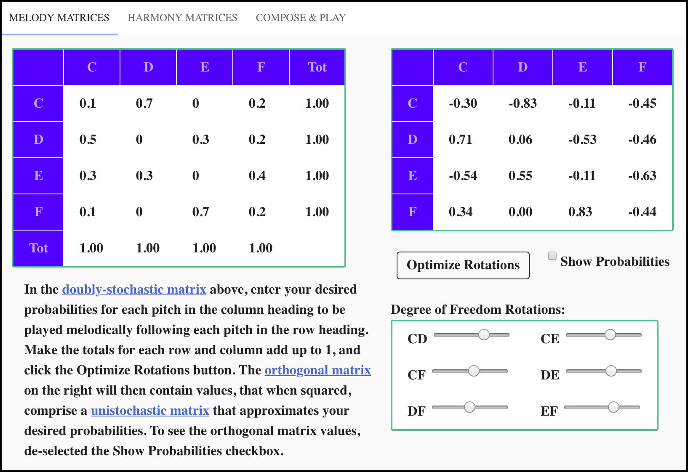
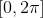

# Quantum Music Composer for IBM quantum computers

The Quantum Music Composer application enables a user to compose music that is performed by a quantum computer. The musical *composition* consists of a series of quantum circuits. Each note in the *performance* of a composition is a quantum state, which when measured results in a pitch determined by quantum mechanical behavior. This normally results in unique melodies and harmonies each time a given composition is performed by the quantum computer. Fig. 1 contains a music score captured from one such performance.

FIG. 1. Music score captured from the performance of a quantum musical composition

To create a quantum musical composition, the user first supplies the desired probabilities for a given pitch to follow another given pitch *melodically*. Take a moment to examine the music score in Fig. 1 and notice that the staff labeled **Melody** contains an eight-note melody. Please also realize that the staff labeled **Harmony** actually contains seven four-note melodies.  Users enter their desired probabilities into the [doubly-stochastic matrix](https://en.wikipedia.org/wiki/Doubly_stochastic_matrix) located on the left side of the **MELODY MATRICES** tab, shown in Fig 2. 

FIG. 2. User interface for composing quantum melodic progressions

Clicking the **Optimize Rotations** button updates the [orthogonal matrix](https://en.wikipedia.org/wiki/Orthogonal_matrix) on the right to contain values, that when squared, comprise a [unistochastic matrix](https://en.wikipedia.org/wiki/Unistochastic_matrix) that approximates the user's desired probabilities. Deselecting and selecting the **Show Probabilities** checkbox toggles between showing the orthogonal matrix and the unistochastic matrix, respectively. The application accomplishes this by gradually changing the angles of the six degree of freedom rotations in four-dimensional vector space until the difference between the doubly-stochastic matrix and the unistochastic matrix is minimized.  You can experiment with the effects of each rotation on the matrix on the right by using the sliders in the **Degree of Freedom Rotations** region of this tab. Each slider has the range  radians.

To continue creating the quantum musical composition, the user supplies the desired probabilities for a given pitch to be played *harmonically* with another given pitch. Take another moment to examine the music score in Fig. 1 and notice that each of the notes in the staff labeled **Melody** have a note in the staff labeled **Harmony** directly above it. Users enter their desired probabilities into the [doubly-stochastic matrix](https://en.wikipedia.org/wiki/Doubly_stochastic_matrix) located on the left side of the **HARMONY MATRICES** tab, shown in Fig 3.

FIG. 3. User interface for composing quantum melodic progressions

 

Here's the Lilipond string: 

\version "2.18.2" \paper {#(set-paper-size "a5")} \header {title="Schrodinger's Cat" subtitle="on a Toy Piano" composer = "A. Quantum Computer"}  melody = \absolute { \clef "bass" \numericTimeSignature \time 4/4 \tempo 4 = 100 c2 f2 e2 c2 d2 c2 c2 c2} harmony = \absolute { \clef "treble" \numericTimeSignature \time 4/4  e'8 c''8 e'8 d'8 d'8 e'8 c'8 d'8 c'8 a'8 f'8 c'8 e'8 f'8 c'8 d'8 f'8 c'8 f'8 c'8 e'8 f'8 f'8 f'8 e'8 d'8 c'8 f'8 c'2} \score { << \new Staff \with {instrumentName = #"Harmony"}  { \harmony } \new Staff \with {instrumentName = #"Melody"}  { \melody } >> }

## Installation

To install.

## References

[1] Volkmar Putz and Karl Svozil, “Quantum music,” (2015), [ arXiv:1503.09045](https://arxiv.org/abs/1503.09045) [quant-ph]

